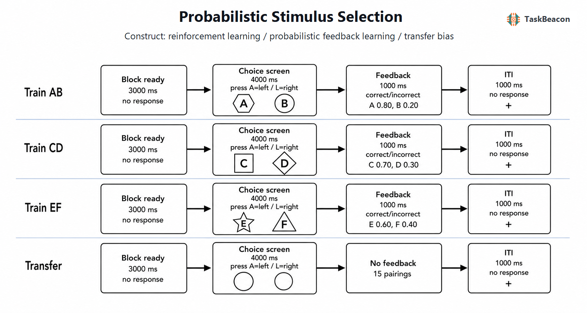

# 概率刺激选择任务：强化学习偏向、迁移测量及其神经认知基础

反馈并不总能可靠地标示某次选择的真实价值。个体需要跨试次整合相互矛盾的结果，并把已获得的价值知识迁移到未曾出现的选择组合。概率刺激选择任务（Probabilistic Stimulus Selection Task, PSST；亦称 Probabilistic Selection Task, PST）以固定刺激对、非确定性反馈和无反馈迁移测验，将上述问题转化为可重复的实验操作。其核心贡献在于：训练阶段的同一正确选择可能源于“选择较常获益刺激”或“回避较常受罚刺激”，而迁移阶段通过把最优刺激 A 与最劣刺激 B 分别同中等价值刺激重组，对两类学习偏向进行相对分离（Frank et al., 2004）。该范式由基底节—多巴胺计算模型的可检验预测发展而来，随后被用于药理、遗传、临床、发展与脑电研究；与此同时，复现和信度研究也表明，其群体平均效应与个体差异测量价值需要分别评价。

## 1. 范式提出与理论背景

PSST 最初用于检验帕金森病及多巴胺药物状态是否以相反方向影响正、负反馈学习。Frank 等（2004）令参与者学习 AB、CD、EF 三对日文假名，其中 A、C、E 获得“正确”反馈的概率分别为 80%、70% 和 60%，对应刺激则为 20%、30% 和 40%。学习后不再呈现反馈，并将 A 或 B 与 C—F 重组：新配对中选择 A 的比例被定义为正强化偏向，回避 B 的比例被定义为负强化偏向。原始研究发现，未服药帕金森病患者更善于回避 B，服用多巴胺能药物时则更善于选择 A，由此把模型所预测的多巴胺“爆发—暂停”非对称性与可观察选择联系起来（Frank et al., 2004）。

这一解释建立在皮质—基底节环路模型之上。模型认为，优于预期的结果通过多巴胺瞬时升高促进纹状体直接通路中的 Go 表征，劣于预期的结果通过多巴胺降低促进间接通路中的 NoGo 表征；两类表征共同约束后续动作选择（Frank, 2005）。健康成人的 D2 受体药理操纵产生了与基线状态相关的 Go/NoGo 学习差异，说明多巴胺效应并非简单的线性“越多越好”（Frank & O’Reilly, 2006）。DARPP-32、DRD2 和 COMT 多态性分别与正反馈学习、负反馈学习及决策阶段的前额叶控制相关，也为多环节分离提供了关联性证据（Frank et al., 2007）。这些结果支持以 PSST 检验强化学习环路，但基因关联、药物效应和计算模型之间的一致性仍不能替代直接因果定位。

## 2. 任务逻辑、流程与核心指标

经典任务包括学习与迁移两个阶段。学习阶段随机穿插 AB、CD、EF 试次，每次呈现一对抽象刺激并要求二选一；选择后出现“正确/错误”或等价结果。反馈按刺激的长期概率抽样，因此单次负反馈并不能证明所选刺激较差。随着概率差从 AB 的 60 个百分点降至 EF 的 20 个百分点，价值辨别逐渐困难。许多版本在一个学习区组后分别检查 AB、CD、EF 正确选择率，未达到标准时继续训练；这一程序减少未习得参与者进入迁移测验的情况，却也使训练剂量与最终样本构成依赖表现（Ragland et al., 2012）。

迁移阶段通常呈现六个刺激的旧配对与新配对而不给反馈。主要因变量包括学习阶段各刺激对正确率、反应时、win-stay/lose-shift，以及迁移阶段总体最优选择率、选择 A 率和回避 B 率。选择 A 与回避 B 的比较具有明确操作意义：两者来自相同学习史，却在新组合中分别强调最优与最劣刺激。高冲突配对还可用于研究接近等值选项间的决策阈值。计算分析通常以 Q 学习分别估计正、负预测误差的学习率，并以逆温度或强化敏感性描述价值差对选择一致性的影响；这类参数能够把学习速度与探索噪声区分开来，但其可辨识性取决于试次数、先验和模型比较。

任务变式揭示了不同心理成分。指令性 PSST 在经验反馈之外告知某一刺激的规则价值，发现指令可持续偏置选择并改变对矛盾反馈的整合，说明标准范式成绩还受显性规则与工作记忆影响（Doll et al., 2009）。瞳孔研究进一步发现，选择前扩张随被选选项的价值信念变化，并预测利用高价值选项的倾向；反馈后的早期扩张与价值不确定性相关，较晚收缩则随有符号奖励预测误差变化（Van Slooten et al., 2018）。因此，学习正确率、迁移偏向和生理反应对应相邻但不等同的过程。

## 3. 主要行为与神经科学发现

### 3.1 正、负反馈学习及其可分离性

药理与临床研究最初较一致地支持多巴胺状态对选择 A 和回避 B 的差异影响，但后续结果显示效应具有条件性。Grogan 等（2017）在帕金森病患者的多次实验中未复现药物对正、负强化表达的经典交互，却发现学习后未服药与 24 小时记忆下降有关。这一结果提示，药物状态可能影响巩固或提取，而不只改变训练当下的学习率。DRD2 A1 等位基因携带者在 PSST 中较难利用负反馈回避不利选择，其后内侧额叶对负反馈的反应及与海马的动态耦合也较弱（Klein et al., 2007）；然而遗传分组无法排除群体分层和多效性，不能把单一位点视为个体学习风格的决定因素。

临床应用同样要求区分总体表现和策略。自闭症谱系障碍青年在高可预测 AB 对上的正确率和 win-stay 低于典型发展组，而中、低概率刺激对表现接近；fMRI 显示典型发展组在刺激阶段更多募集前部与内侧前额叶，自闭症组在反馈阶段持续表现出前扣带和眶额活动（Solomon et al., 2015）。这些结果支持奖励信息在线维持与逐试次反馈依赖之间的策略差异，但研究排除了未能达到学习标准的部分参与者，结论不宜推广为谱系总体的单一缺陷。成瘾相关样本中，PSST 表现与多巴胺相关遗传和人格指标的关系亦未完全符合 Go/NoGo 模型，进一步说明该任务受注意、动机和显性策略共同影响（Baker et al., 2013）。

### 3.2 fMRI 与 EEG 所揭示的阶段性过程

fMRI 证据把 PSST 的神经解释从单一纹状体指标扩展为反馈监测、价值维持与选择控制的网络协作。负反馈后的后内侧额叶活动及其与海马的耦合可预测后续回避学习（Klein et al., 2007）；自闭症研究则显示，刺激阶段的前额叶价值维持和反馈阶段的扣带—眶额募集可以发生分离（Solomon et al., 2015）。因此，同一迁移成绩可能由较稳定的刺激价值表征或持续的逐试次纠错产生。BOLD 差异提供空间分布及条件相关信息，尚不足以证明某一区域对选择 A 或回避 B 具有专属因果作用。

EEG 结果补充了反馈加工的时间进程。反馈相关额中线 theta 随预测误差变化，并与下一试次的行为调整相关；该联系支持额中线控制系统将结果评价转化为策略修正，而头皮信号不能单独确定其深部来源（Cavanagh et al., 2010）。老年参与者在 PSST 学习期表现出减弱的反馈负波和额叶 P3，提示局部反馈评价及跨区域信息整合均可能随年龄改变（West & Huet, 2020）。近期扩展训练研究发现，奖励正波在早期主要出现于反馈，后期转移至预测线索；快速学习者的这种时间反向传播更明显，并伴随较高的学习率（Gao et al., 2026）。这一结果直接支持时序差分学习关于预测误差由结果向线索转移的预期，同时也表明只分析反馈锁定成分可能遗漏已习得线索的价值编码。

## 4. 范式发展与主要应用

PSST 的发展主要沿三条方向展开。其一，以药物、疾病和遗传差异检验多巴胺相关学习模型，并由最初的帕金森病推广至精神分裂症、自闭症与物质使用研究；CNTRICS 因其构念基础与影像适用性将概率选择任务列为值得进一步发展的强化学习候选指标，但同时指出任务偏长和心理测量证据不足（Ragland et al., 2012）。其二，将眼动、EEG 和计算模型嵌入逐试次分析，使研究对象由终点正确率扩展到不确定性、预测误差和价值更新（Cavanagh et al., 2010; Van Slooten et al., 2018）。其三，改变结果类型、训练来源或测试组合，研究发展与生理差异。采用概率反转学习后的无反馈全配对测试显示，青少年更常选择新异刺激，且正反馈对行为的影响较弱；由于其训练阶段并非经典三刺激对 PSST，该结果更适合说明迁移测验的扩展用途（Waltmann et al., 2023）。铁缺乏研究把 PSST 与 EEG、视网膜电图结合，发现视网膜电图潜伏期中介铁水平与任务准确率的关系，但小样本关联尚不能证明多巴胺是唯一机制（Newbolds & Wenger, 2024）。

## 5. 测量效度与解释边界

PSST 具有较好的表面效度和操作清晰度：概率反馈要求跨试次整合结果，无反馈重组检验已学价值的迁移；选择 A 与回避 B 的被试内比较也降低了总体正确率差异的部分影响。效度边界来自指标的非唯一性。选择 A 可能同时反映 A 的正价值、对替代刺激的相对估值、记忆强度与决策一致性；回避 B 也可能受到 B 的显著性、配对结构和探索策略影响。训练达标规则进一步造成选择性：未达标者被排除或接受更多训练，均会改变迁移指标的可比性。反馈概率、刺激可言语化程度、金钱或符号反馈、试次上限与延迟测试也可能改变所测构念。

个体差异研究尤其受可靠性约束。Xu 与 Stocco（2021）通过大量模拟指出，传统选择 A/回避 B 终点分数对有限试次中的随机反馈敏感，同一潜在学习者可在不同测量中呈现相反偏向；其实验中行为分数的重测信度很低，而贝叶斯最大后验法恢复的模型参数达到约 0.4—0.5 的组内相关。稳定的群体效应因而不保证可靠的个体排序。PSST 适合检验实验操纵与群体机制假设；若用于临床分层或个体预测，应预注册排除标准，报告学习阶段和迁移阶段的完整指标，进行模型恢复与参数恢复，并在目标样本中独立估计重测信度。

## 6. TaskBeacon 中的任务实现

### 6.1 任务资源与访问入口

| 资源 | ID | 用途 | 地址 |
|---|---|---|---|
| 完整行为实验实现 | T000040 | PsychoPy/PsyFlow 本地实验、数据采集与分析 | [GitHub 仓库](https://github.com/TaskBeacon/T000040-probabilistic-stimulus-selection) |
| 浏览器伴随实现 | H000040 | 基于 psyflow-web 的行为型网页版本源码 | [GitHub 仓库](https://github.com/TaskBeacon/H000040-probabilistic-stimulus-selection) |
| 在线运行入口 | H000040 | 公开浏览器体验与行为数据导出 | [运行任务](https://taskbeacon.github.io/psyflow-web/?task=H000040-probabilistic-stimulus-selection) |

T000040 与 H000040 当前均为行为采集版本；网页实现保留三对学习、达标循环和 15 种迁移配对，并不涉及 EEG 或 fMRI 采集。在线入口适合熟悉参与者流程和开展浏览器行为研究，网页时序须在目标设备上验证。

### 6.2 实现流程与关键参数

TaskBeacon 当前版本采用六个日文假名，按参与者编号所确定的种子随机映射至 A—F 角色。学习阶段每区组包含 60 个试次，即 AB、CD、EF 各 20 次；每一刺激在左右位置各出现一半。AB、CD、EF 的反馈概率分别为 80/20、70/30、60/40。各区组后按较高概率角色的选择正确率检查标准：AB≥0.65、CD≥0.60、EF≥0.50；三项同时达标即进入迁移，否则最多完成 6 个学习区组。达到上限后即使未全部达标也继续迁移。迁移阶段呈现六刺激的全部 15 种两两组合，每种 10 次，共 150 试次且无反馈。主要记录包括刺激角色与位置、按键、反应时、超时、学习期实际反馈结果、累计隐藏分数及迁移选择角色；隐藏分数不向参与者显示。

**图 1. TaskBeacon 当前版本的试次与阶段流程。** 每个区组先呈现 3000 ms 准备页。选择阶段左右呈现两个假名，参与者在 4000 ms 内按 A 选择左侧或按 L 选择右侧；学习试次分别从 AB（A=.80、B=.20）、CD（C=.70、D=.30）和 EF（E=.60、F=.40）的角色概率中抽取“正确/错误”反馈并呈现 1000 ms，随后呈现 1000 ms 注视点。学习超时计为错误。每区组按较高概率角色的选择率检验 AB≥.65、CD≥.60、EF≥.50，全部达标则结束学习，未达标时重复且最多 6 个区组。迁移区组采用 15 种角色配对，每种 10 次；选择窗同为 4000 ms，省略反馈后直接进入 1000 ms 试次间隔。图中的几何形状用于表示抽象角色；实际程序呈现按参与者随机映射的日文假名。

该实现保留了经典概率结构与无反馈迁移逻辑，并把反应窗固定为 4 秒、反馈与试次间隔各固定为 1 秒。固定时序便于行为实施，但不含事件相关 fMRI 常用的抖动；若研究目标是分离刺激、反馈和间隔期 BOLD 反应，需要据成像设计重新配置时序。当前反馈文字为“正确/错误”，累计分数仅内部记录，现有仓库文件无法确认其是否兑换为实际金钱，因此不宜把结果直接解释为货币奖赏敏感性。

## 参考文献

Baker, T. E., Stockwell, T., & Holroyd, C. B. (2013). Constraints on decision making: Implications from genetics, personality, and addiction. *Cognitive, Affective, & Behavioral Neuroscience, 13*(3), 417–436. https://doi.org/10.3758/s13415-013-0164-8

Cavanagh, J. F., Frank, M. J., Klein, T. J., & Allen, J. J. B. (2010). Frontal theta links prediction errors to behavioral adaptation in reinforcement learning. *NeuroImage, 49*(4), 3198–3209. https://doi.org/10.1016/j.neuroimage.2009.11.080

Doll, B. B., Jacobs, W. J., Sanfey, A. G., & Frank, M. J. (2009). Instructional control of reinforcement learning: A behavioral and neurocomputational investigation. *Brain Research, 1299*, 74–94. https://doi.org/10.1016/j.brainres.2009.07.007

Frank, M. J. (2005). Dynamic dopamine modulation in the basal ganglia: A neurocomputational account of cognitive deficits in medicated and nonmedicated Parkinsonism. *Journal of Cognitive Neuroscience, 17*(1), 51–72. https://doi.org/10.1162/0898929052880093

Frank, M. J., Moustafa, A. A., Haughey, H. M., Curran, T., & Hutchison, K. E. (2007). Genetic triple dissociation reveals multiple roles for dopamine in reinforcement learning. *Proceedings of the National Academy of Sciences of the United States of America, 104*(41), 16311–16316. https://doi.org/10.1073/pnas.0706111104

Frank, M. J., & O’Reilly, R. C. (2006). A mechanistic account of striatal dopamine function in human cognition: Psychopharmacological studies with cabergoline and haloperidol. *Behavioral Neuroscience, 120*(3), 497–517. https://doi.org/10.1037/0735-7044.120.3.497

Frank, M. J., Seeberger, L. C., & O’Reilly, R. C. (2004). By carrot or by stick: Cognitive reinforcement learning in parkinsonism. *Science, 306*(5703), 1940–1943. https://doi.org/10.1126/science.1102941

Gao, Y., Wilson, R., Karpov, G., & Baker, T. E. (2026). The reward positivity tracks positive reward prediction errors from feedback to cues during reinforcement learning. *Psychophysiology, 63*(5), e70308. https://doi.org/10.1111/psyp.70308

Grogan, J. P., Tsivos, D., Smith, L., Knight, B. E., Bogacz, R., Whone, A., & Coulthard, E. J. (2017). Effects of dopamine on reinforcement learning and consolidation in Parkinson’s disease. *eLife, 6*, e26801. https://doi.org/10.7554/eLife.26801

Klein, T. A., Neumann, J., Reuter, M., Hennig, J., von Cramon, D. Y., & Ullsperger, M. (2007). Genetically determined differences in learning from errors. *Science, 318*(5856), 1642–1645. https://doi.org/10.1126/science.1145044

Newbolds, S. F., & Wenger, M. J. (2024). Assessing the pattern electroretinogram as a proxy measure for dopamine in the context of iron deficiency. *Nutritional Neuroscience, 27*(10), 1131–1142. https://doi.org/10.1080/1028415X.2024.2304943

Ragland, J. D., Cohen, N. J., Cools, R., Frank, M. J., Hannula, D. E., & Ranganath, C. (2012). CNTRICS imaging biomarkers final task selection: Long-term memory and reinforcement learning. *Schizophrenia Bulletin, 38*(1), 62–72. https://doi.org/10.1093/schbul/sbr168

Solomon, M., Frank, M. J., Ragland, J. D., Smith, A. C., Niendam, T. A., Lesh, T. A., Grayson, D. S., Beck, J. S., Matter, J. C., & Carter, C. S. (2015). Feedback-driven trial-by-trial learning in autism spectrum disorders. *American Journal of Psychiatry, 172*(2), 173–181. https://doi.org/10.1176/appi.ajp.2014.14010036

Van Slooten, J. C., Jahfari, S., Knapen, T., & Theeuwes, J. (2018). How pupil responses track value-based decision-making during and after reinforcement learning. *PLoS Computational Biology, 14*(11), e1006632. https://doi.org/10.1371/journal.pcbi.1006632

Waltmann, M., Herzog, N., Reiter, A. M. F., Villringer, A., Horstmann, A., & Deserno, L. (2023). Diminished reinforcement sensitivity in adolescence is associated with enhanced response switching and reduced coding of choice probability in the medial frontal pole. *Developmental Cognitive Neuroscience, 60*, 101226. https://doi.org/10.1016/j.dcn.2023.101226

West, R., & Huet, A. (2020). The effect of aging on the ERP correlates of feedback processing in the probabilistic selection task. *Brain Sciences, 10*(1), 40. https://doi.org/10.3390/brainsci10010040

Xu, Y., & Stocco, A. (2021). Recovering reliable idiographic biological parameters from noisy behavioral data: The case of basal ganglia indices in the probabilistic selection task. *Computational Brain & Behavior, 4*(3), 318–334. https://doi.org/10.1007/s42113-021-00102-5
